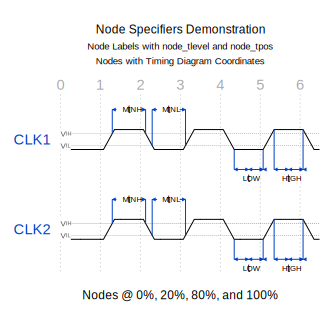
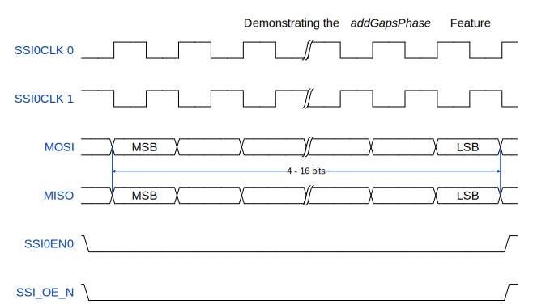
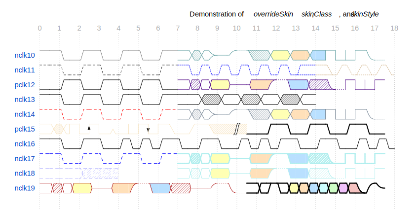

- [Introducing WaveDrom 24.01](#introducing-wavedrom-2401)
  - [Background and Motivation](#background-and-motivation)
  - [WaveJSON Grammar](#wavejson-grammar)
  - [Feature Set Updates](#feature-set-updates)
    - [New Skins](#new-skins)
    - [New Configuration Attributes](#new-configuration-attributes)
      - [Fractional *hscale* Support](#fractional-hscale-support)
      - [Auto-Scaled Waveforms with *fit2pane*](#auto-scaled-waveforms-with-fit2pane)
      - [Avoiding *style* and *defs* Leakage with *wrapSvgInImg*](#avoiding-style-and-defs-leakage-with-wrapsvginimg)
      - [Tweaking Arc Label Placement with *txtBaseline*](#tweaking-arc-label-placement-with-txtbaseline)
      - [Tuning Rendering Results with *customStyle*](#tuning-rendering-results-with-customstyle)
      - [Waveform Rendering Palette Modification with *colorMode*](#waveform-rendering-palette-modification-with-colormode)
    - [New Signal Attributes](#new-signal-attributes)
      - [Referencing Signal Lanes with the *id* Attribute](#referencing-signal-lanes-with-the-id-attribute)
      - [Multi-Threshold Annotations with \*node\_tlevel\* and \*node\_tpos\*](#multi-threshold-annotations-with-node_tlevel-and-node_tpos)
      - [Tweaking Data Labels Rendering with *dlClass* and *dlStyle*](#tweaking-data-labels-rendering-with-dlclass-and-dlstyle)
      - [Assembling Multiple Waveforms in a Single Lane with *overlayOnLane*](#assembling-multiple-waveforms-in-a-single-lane-with-overlayonlane)
      - [Tweaking Gaps Placement with *addGapsPhase*](#tweaking-gaps-placement-with-addgapsphase)
      - [Modifying Bricks on a Per-Lane Basis with *overrideSkin*, *skinClass*, and *skinStyle*](#modifying-bricks-on-a-per-lane-basis-with-overrideskin-skinclass-and-skinstyle)
    - [New Wave Specifications](#new-wave-specifications)
      - [Arbitrary Text Labels with *tl*](#arbitrary-text-labels-with-tl)
      - [Multiple Piecewise Linear (PWL) Components and Text Labels in a Lane](#multiple-piecewise-linear-pwl-components-and-text-labels-in-a-lane)
      - [Fine-Tuning PWL Renders with *pwClass* and *pwStyle*](#fine-tuning-pwl-renders-with-pwclass-and-pwstyle)
    - [Revisiting the *edge* Architecture](#revisiting-the-edge-architecture)
      - [Enforcing Horizontal Arcs with Flexible Label Positioning](#enforcing-horizontal-arcs-with-flexible-label-positioning)
      - [Full *tspan* Support for Edge Labels](#full-tspan-support-for-edge-labels)
      - [Timing Diagram Coordinates Scheme for Node Locations](#timing-diagram-coordinates-scheme-for-node-locations)
      - [Re-factored Edge Shape Implementation](#re-factored-edge-shape-implementation)
    - [Miscellaneus Features](#miscellaneus-features)
      - [Pre-Export SVG Optimization](#pre-export-svg-optimization)
      - [WaveJSON Metadata Inclusion in Exported SVG](#wavejson-metadata-inclusion-in-exported-svg)
      - [Improved PNG Export](#improved-png-export)
      - [Improved Dimensions Estimation for Text Elements](#improved-dimensions-estimation-for-text-elements)
      - [Grouping of Text Elements for a Better *tspan* Experience](#grouping-of-text-elements-for-a-better-tspan-experience)
      - [Fine-Tuning the *hbounds* Feature](#fine-tuning-the-hbounds-feature)
      - [Supporting Multiple Transition Slopes for Node Placement](#supporting-multiple-transition-slopes-for-node-placement)
  - [Bug Fixes and Issue Resolutions](#bug-fixes-and-issue-resolutions)
    - [Fixing up Subcycles Support](#fixing-up-subcycles-support)
    - [Handling Phase Artifacts](#handling-phase-artifacts)
    - [SVG 1.1 Validation Checks](#svg-11-validation-checks)
    - [Cleaning up the *tick* \& *tock* Implementation](#cleaning-up-the-tick--tock-implementation)
    - [Text Labels on Single-Bit Bricks](#text-labels-on-single-bit-bricks)
    - [Multi-Line Data Labels](#multi-line-data-labels)
  - [Enabling a Plugin Architecture](#enabling-a-plugin-architecture)
    - [Custom Wave Specifications - Trigonometric Functions](#custom-wave-specifications---trigonometric-functions)
    - [Custom Wave Specifications - Asynchronous Signals](#custom-wave-specifications---asynchronous-signals)
    - [Custom Wave Specifications - Bipolar Signals](#custom-wave-specifications---bipolar-signals)
  - [Project Roadmap](#project-roadmap)
    - [Known Issues](#known-issues)
    - [Pull-Request Submission Invites](#pull-request-submission-invites)

# Introducing WaveDrom 24.01

## Background and Motivation

WaveDrom is a timing diagram (waveform) generator widely used in
engineering circles. It converts textual description specified as a JSON
object (\'WaveJSON\' in WaveDrom parlance) into a vector graphics file
(in the SVG format). The use of vector graphics ensures that the
diagrams are of high quality and resistant to scaling artifacts. The
software uses a library of \'bricks\' (\'skin\' in WaveDrom parlance) to
assemble waveforms. The usage of standard building blocks ensures a
consistent look for the rendering of different signal lanes. Waveforms
created by different users also tend to have a consistent look as long
as the same skin is being used. By virtue of being written in
JavaScript, the software is inherently cross-platform and can be run
locally using any modern web browser.

The clean and consistent look of the WaveDrom output makes it a
candidate for generating professional electrical diagrams. These are
meant for inclusion in customer-facing documents such as datasheets and
programming reference manuals. Back in 2019, the folks at Ambarella
attempted to use WaveDrom for this purpose. However, some shortcomings
of the software complicated the creation of some of the complex
waveforms. These included the [inability to combine two different
waveforms in the same signal
lane](https://github.com/wavedrom/wavedrom/issues/121) (to create, for
example, a DDR clock waveform), [over-estimation of label
widths](https://github.com/wavedrom/wavedrom/issues/265) leading to
disfigured waveforms, and [inability to composite two different
SVGs](https://github.com/wavedrom/wavedrom/issues/263) for
post-processing, among others. As a result, many of the output SVGs had
to be manually edited to deliver a production-worthy waveform. This was
not turning out to be a scalable solution with the growth in the number
of SVGs and the need to fine-tune previously-finalized ones based on
feedback.

Thanks to the open-source nature of the software, a custom fork was made
possible. Features were slowly added and refined based on user
requirements over the last four years. A survey of WaveJSON extensions
supported by other software such as
[SchemDraw](https://github.com/cdelker/schemdraw) and pending WaveDrom
pull requests was also made. These were also incorporated with
appropriate modifications into the custom fork. In the course of
verification, a large number of bug fixes addressing existing open
issues was also made.

WaveDrom 24.01 incorporates all the updates made over the last four
years in Ambarella\'s custom fork. It aims to extend WaveDrom\'s feature
set to address technical documentation requirements from a marketing
perspective while firming up its credentials as the de-facto solution
for engineers. As part of this overhaul, updates have been made to the
core WaveDrom engine as well as the web-based editor. The scope of this
document is restricted to the core WaveDrom engine.

## WaveJSON Grammar

The [schema
repository](https://github.com/wavedrom/schema/blob/master/waveschema.json)
currently maintained on Github under WaveDrom serves as a comprehensive
JSON representation of the WaveJSON schema. The EBNF (Extended
Backus-Naur Form) representation of the grammar provides a more concise
and terse overview. This makes it suitable for comparing extensive
updates like the ones made in the move from WaveDrom 3.3.0 to WaveDrom
24.01. The EBNF representation of the WaveJSON scheme as supported by
WaveDrom 3.3.0 is available
[here](https://github.com/Ganesh-AT/wavedrom/blob/master/WaveJSON-Grammar.txt).
The corresponding representation for the schema supported by WaveDrom
24.01 is maintained
[here](https://github.com/Ganesh-AT/wavedrom/blob/wavedrom-24.01/WaveJSON-Grammar.txt).
The new grammar is completely backwards-compatible, meaning that valid
WaveJSON inputs for WaveDrom 3.3.0 will continue to work with WaveDrom
24.01. The rendered output also remains the same, except for bug fixes.

A quick overview of the new features is obtained via Github\'s [diff
view of the two grammar
representations](https://github.com/Ganesh-AT/wavedrom/compare/master...wavedrom-24.01#diff-5d9dd9d1500a808115d428b898d28cb38c6a5582a822ede99298dad4fd0b4bc4).
The remainder of this document analyzes each update in detail, along
with links to examples However, a look at the new skins included in
WaveDrom 24.01 is in order first.

## Feature Set Updates

### New Skins

The WaveDrom skins dictate the appearance of various bricks along with
the styles of the markers used in the arcs (edge specifications).
Subjectively speaking, the marker style in the *default* skin is
slightly over-sized and has too much of an offset from the arc\'s end
points for professional documents. After a few trials, new marker styles
were finalized and incorporated into a new *professional* skin. This
formed the basis for the two additional skins described below.

Some timing diagrams require the annotation of different threshold
levels. The rise and fall times of the signals in the *default* skin are
too short to bring those out in an uncluttered manner. A new
\*professional*srf\* skin was prepared with signal transitions over 11
horizontal units (compared to the 6 in the *default\_ skin).

The representation of the transition to high-impedance states in the
*default* skin is electrically accurate, but technical document
requirements dictate a professional look with sharp transitions. The
bundled \*professional_sharpz\* skin addresses this aspect.

[Using the Professional Skins - WaveJSON](demo/professional-skins.json)

[ObservableHQ
Playground](https://observablehq.com/@ganesh-at-ws/wavedrom-24-01-professional-skins-fit2pane)
\[ Manually process the first cell with the FileAttachment list if the
rendering doesn\'t match the SVG output below \].


### New Configuration Attributes

#### Fractional *hscale* Support

WaveDrom 3.3.0 supports only positive integer values for the *hscale*
attribute in the *config* object. The [updated
grammar](https://github.com/Ganesh-AT/wavedrom/compare/master...wavedrom-24.01#diff-5d9dd9d1500a808115d428b898d28cb38c6a5582a822ede99298dad4fd0b4bc4R50)
for WaveDrom 24.01 adds support for fractional values less than 1.

This feature is meant to horizontally compress timing diagrams rendering
a large number of cycles. One of the oft-suggested remedies for such
diagrams is the use of the *narrow* skin. *narrower* and *narrowerer*
skins have also been created for diagrams involving 100+ cycles. While
the *narrow* skin is a true skin with different transition slopes
compared to the *default* one, the others are simply scaled versions of
the *narrow* skin with scaling values set to 0.5 and 0.25. The
incorporation of support for fractional *hscale* less than 1 avoids the
need for skins that are simply scaled versions of existing ones. It also
provides users with flexibility to adjust the horizontal width - an
aspect that is not possible with pre-generated skins.

It must be noted that the fractional *hscale* is not a straightforward
scaling operation on the whole diagram. Only the rendered bricks and
edge / node coordinates are scaled. Squished labels and arrows are
avoided by retaining the text and marker sizes based on the diagram\'s
skin and other configuration parameters.

[Exploring Fractional *hscale* - WaveJSON](demo/fractional-hscale.json)

[ObservableHQ
Playground](https://observablehq.com/@ganesh-at-ws/wavedrom-24-01-0-fractional-hscale)


It is possible to apply this feature to any diagram - even ones with
just a couple of cycles. This can create funny-looking waveforms with
cut-off header text and the like. However, that is not the intended
use-case for this feature. Rather, real-world timing diagrams like the
one above are the intended target.

#### Auto-Scaled Waveforms with *fit2pane*

The 20x20 bricks used by WaveDrom are too small when viewed at their
native resolution in large-sized monitors with high-resolution displays.
In such setups, waveforms dealing with a small number of cycles are
often too tiny to make out the real-time feedback in the web-based
editor. On the other hand, large waveforms in small-sized browser
windows may result in the user having to resort to horizontal scrolling
to view the effects of their edits. In such cases, users often lose
sight of the signal names on the left in the process of checking updates
at the right edge.

Fortunately, the use of vector graphics allows the resultant diagram to
be fitted inside the available viewport without loss of detail. A [new
configuration bit
(*fit2pane*)](https://github.com/Ganesh-AT/wavedrom/compare/master...wavedrom-24.01#diff-5d9dd9d1500a808115d428b898d28cb38c6a5582a822ede99298dad4fd0b4bc4R54)
can be used to enable this feature. It is disabled by default to retain
backwards compatibility.

[Enabling the *fit2pane* Feature - WaveJSON](demo/fit2pane-true.json)

[Disabling the *fit2pane* Feature - WaveJSON](demo/fit2pane-false.json)

[ObservableHQ
Playground](https://observablehq.com/@ganesh-at-ws/wavedrom-24-01-0-fit2pane-true-v-false)


Enabling this feature doesn\'t alter the core contents of the rendered
SVG. By default, the width and height of the picture are set to the
rendered image\'s absolute width and height. If *fit2pane* is set, the
width and height are configured to 100% of the picture\'s container
element.

#### Avoiding *style* and *defs* Leakage with *wrapSvgInImg*

The CSS and SVG specifications share a lot in common. CSS styles
specified anywhere in the document (even outside the SVG container, or
inside another one) are available for use within a SVG, and vice-versa.
This applies to SVG *defs* elements too. *defs* specified for a SVG can
end up causing issues in another SVG on the same page if it re-uses the
same element name with different characteristics. WaveDrom includes
support for embedding multiple waveforms in a single webpage. All the
examples for this feature currently employ the same skin for all
waveforms in a given page. The inability to embed waveforms using
different skins, say, *default* and *narrow*, on the same page is an
oft-raised issue.

WaveDrom 24.01 initially addressed this issue by prefixing each brick
element in the *defs* section and the utilized class names in the
*style* section using a skin-based identifier. However, this doesn\'t
address the markers or user-defined styles. A [new configuration bit
(*wrapSvgInImg*)](https://github.com/Ganesh-AT/wavedrom/compare/master...wavedrom-24.01#diff-5d9dd9d1500a808115d428b898d28cb38c6a5582a822ede99298dad4fd0b4bc4R55)
is available in WaveDrom 24.01 to prevent leakage of such elements
across different SVGs on the same page.

This bit is set to *true* by default to allow embedding of multiple SVGs
with different characteristics on the same page. The ObservableHQ
infrastructure for WaveDrom demonstrations (using the *wd* function)
captures the rendering output from the engine prior to the wrapping
operation. As a result, a live playground link is not available for
experimenting with this configuration bit. However, the demo files
linked below can be downloaded and rendered locally as long as the
source scripts in the header are also available at the appropriate
relative path locations.

The sample screenshot below is from the rendering of this [HTML
file](demo/test-leakage-wrapSvgInImg-true.html) with a segment of the
browser developer tools visible.


It can be seen that none of the three WaveJSON inputs have any whiff of
the *wrapSvgInImg* attribute. Each embedded waveform obeys the
parameters of its primary skin, and there is no leakage of the marker
element. The elements debugger on the right shows that the SVG is
wrapped as a data string inside an IMG tag for all the three renders.

Backwards compatibility can be obtained by explicity turning off the
*wrapSvgInImg* attribute, as shown in this [HTML
file](demo/test-leakage-wrapSvgInImg-false.html). A screenshot of this
rendering is shown below.


Two different aspects are worth pointing out here. The markers in the
diagrams with the *default* and *narrow* skins end up using the elements
in the *professional* skin. It is different from the standalone
rendering for both the WaveJSON inputs. Secondly, the browser developer
tools show that the SVGs are embedded directly in the page, and their
elements can be tracked from the same view.

This config attribute has no impact on the appearance of SVGs rendered
from standalone WaveJSON inputs. Advanced users might prefer to turn off
the feature to check up on the organization of the SVG elements using
the browser\'s developer tools. This is useful for debugging purposes,
but the end users of the software have no reason to bother with altering
the attribute\'s default value.

It must also be noted that the brick characteristics do not leak
irrespective of the configured *wrapSvgInImg* value. The leakage only
applies to the markers and optional custom styles.

#### Tweaking Arc Label Placement with *txtBaseline*

The SVG specifications provide a *dominant-baseline* attribute for text
elements. It allows the fine-tuning of the placement of the text
relative to the specified coordinates. In most cases, the default
settings combined with WaveDrom\'s coordinates computation provide an
acceptable appearance for the labels spcified in the WaveJSON *edge*
object. In rare cases, it might be necessary to tweak the placement. The
[new *txtBaseline* configuration
attribute](https://github.com/Ganesh-AT/wavedrom/compare/master...wavedrom-24.01#diff-5d9dd9d1500a808115d428b898d28cb38c6a5582a822ede99298dad4fd0b4bc4R56)
fulfils this purpose.

[Configuring the *txtBaseline* Feature -
WaveJSON](demo/txtBaseline-options.json)

[ObservableHQ
Playground](https://observablehq.com/@ganesh-at-ws/wavedrom-24-01-txtbaseline)


This feature is recommended for use only in small diagrams with few arc
/ edge labels. Complex diagrams often require much more flexibility,
which is provided by the user-configurable \*arc*label\* style class in
the *customStyle\_ option. WaveDrom 24.01 also brings in *tspan* support
for edge labels, and that allows for per-label modification using native
CSS attributes.

#### Tuning Rendering Results with *customStyle*

WaveDrom 24.01 provides immense flexibility in tweaking the appearance
of various components of the timing diagram. A part of this flexibility
is enabled by support for the specification of custom styles using the
[new
*customStyle*](https://github.com/Ganesh-AT/wavedrom/compare/master...wavedrom-24.01#diff-5d9dd9d1500a808115d428b898d28cb38c6a5582a822ede99298dad4fd0b4bc4R57)
string attribute. Users unfamiliar with SVG stylesheets should peruse
documentation related to [CSS
basics](https://developer.mozilla.org/en-US/docs/Learn/Getting_started_with_the_web/CSS_basics)
and [class
selectors](https://developer.mozilla.org/en-US/docs/Web/CSS/Class_selectors)
in order to understand the usage of this option.

The appearance of various elements in waveforms generated by WaveDrom
24.01 is dictated by the *class* assigned to them during the rendering
process. The specifications of the classes involved in the default
appearance are documented
[here](https://github.com/Ganesh-AT/wavedrom/blob/wavedrom-24.01/bin/svg2js.js#L97-L127).
It includes the default style for all text elements as the first entry.
It must be noted that the specifications for the classes used by the
bricks are not part of the above extract, as they are sourced from the
skin\'s SVG.

The elements corresponding to the different style classes can be
inferred from the WaveDrom parlance for different components of a
rendered waveform. Two different renders are reproduced below to bring
them out. Almost all elements in the first waveform below are created
using straightforward WaveJSON features, except for the text label that
appears to be part of the edge specifications. The annotation is
actually rendered as a text label, as evident from this
[line](https://github.com/Ganesh-AT/wavedrom/blob/wavedrom-24.01/demo/customStyle-options.json#L66).


The aspects below deserve pointing out in the above diagram: \* Text
labels are rendered from the *tl* specifications in the *wave*
component, and is part of the new WaveDrom 24.01 grammar. \* Group
labels are the name given to the string specified as the first member of
any array that is a first-level component of the *signal* array. \*
Group paths are the name given to the shapes rendered to signify a
collection of signals. \* Arc labels are either the strings that follow
the node and arc shape components in the *edge* array components or the
node labels themselves. \* Arc paths denote the rendering of the lines
resulting from the arc shape specifications in the *edge* array
components


WaveDrom renders diagrams using a collection of \'bricks\' from a
library (the *skin* specified in the *config* object). Each character in
the *wave* string corresponds to two bricks under the default settings
of *hscale* and *period* being 1. In the sub-cycle mode, each character
corresponds to one brick. The render above also shows piece-wise linear
waveforms specified using the *pw* feature of the *wave* attribute.

The *customStyle* attribute in the *config* object is a user-supplied
string that gets appended to the skin\'s *style* entry. The placement at
the end ensures that previous element and class entries can be
completely overridden, if desired. Obviously, style sets with new class
names can also be specified. The WaveDrom engine supports pre-defined
class names for specific elements. Custom class names can be used for
others.

The table below summarizes the different ways to fine-tune the
appearance of various elements.

<table width=100% id="customStyleTbl">
    <tr>
        <td width = "17.5%" align="center" valign="middle"><b>Element</b></td>
        <td width = "27.5%" align="center" valign="middle"><b>Waveform-Wide Customization</b></td>
        <td width = "27.5%" align="center" valign="middle"><b>Per-Lane Customization</b></td>
        <td width = "27.5%" align="center" valign="middle"><b>Per-Element Customization</b></td>
    </tr>
    <tr>
        <td colspan="4">&nbsp;</td>
    </tr>
    <tr>
        <td valign="middle">Arc Paths</a>
        <td width = "27.5%" align="center" valign="middle">.arc_path{} in <i>config.customStyle</i></td>
        <td width = "27.5%" align="center" valign="middle">Not Applicable</td>
        <td width = "27.5%" align="center" valign="middle">Custom classes in <i>config.customStyle</i> referenced in the edge specifier</td>
    </tr>
    <tr>
        <td valign="middle">Group Paths</a>
        <td width = "27.5%" align="center" valign="middle">.group_path{} in <i>config.customStyle</i></td>
        <td width = "27.5%" align="center" valign="middle">Not Applicable</td>
        <td width = "27.5%" align="center" valign="middle">Not Available</td>
    </tr>
    <tr>
        <td valign="middle">Arc Labels</a>
        <td width = "27.5%" align="center" valign="middle">.arc_label{} &amp; text{} in <i>config.customStyle</i></td>
        <td width = "27.5%" align="center" valign="middle">Not Applicable</td>
        <td width = "27.5%" align="center" valign="middle">Edge labels support <i>tspan</i>, but per-element customization for visible named nodes is not available.</td>
    </tr>
    <tr>
        <td valign="middle">Group Labels</a>
        <td width = "27.5%" align="center" valign="middle">.group_label{} &amp; text{} in <i>config.customStyle</i></td>
        <td width = "27.5%" align="center" valign="middle">Not Applicable</td>
        <td width = "27.5%" align="center" valign="middle">Group labels support <i>tspan<i></td>
    </tr>
    <tr>
        <td valign="middle">Lane Labels</a>
        <td width = "27.5%" align="center" valign="middle">.lane_label{} &amp; text{} in <i>config.customStyle</i></td>
        <td colspan="2" width = "27.5%" align="center" valign="middle">Lane labels (signal names) can be specified as <i>tspan</i> entries</td>
    </tr>
    <tr>
        <td valign="middle">Data Labels</a>
        <td width = "27.5%" align="center" valign="middle">.data_label{} &amp; text{} in <i>config.customStyle</i></td>
        <td width = "27.5%" align="center" valign="middle">Custom classes in <i>config.customStyle</i> referenced as <i>dlClass</i>, or style directly specified in <i>dlStyle</i></td>
        <td width = "27.5%" align="center" valign="middle">Data labels can be <i>tspan</i> entries</td>
    </tr>
    <tr>
        <td valign="middle">Text Labels</a>
        <td width = "27.5%" align="center" valign="middle">text{} in <i>config.customStyle</i></td>
        <td width = "27.5%" align="center" valign="middle">Not Applicable</td>
        <td width = "27.5%" align="center" valign="middle">Custom classes in <i>config.customStyle</i> referenced as <i>tlClass</i>, or style directly specified in <i>tlStyle</i>.<br/>Finer customization is possible with <i>tspan</i> support.</td>
    </tr>
    <tr>
        <td valign="middle">Piece-Wise Linear Paths</a>
        <td width = "27.5%" align="center" valign="middle">Not Available</td>
        <td colspan="2" width = "55%" align="center" valign="middle">Custom classes in <i>config.customStyle</i> referenced as <i>pwClass</i>, or style directly specified in <i>pwStyle</i>.<br/>Different styles in the same lane can be obtained using the <i>overlayOnLane</i> feature.</td>
    </tr>
    <tr>
        <td valign="middle">Bricks in Skin</a>
        <td width = "27.5%" align="center" valign="middle"><i>skin</i> attribute in the _config_ object</td>
        <td colspan="2" width = "55%" align="center" valign="middle"><i>overrideSkin</i> in the signal lane, if such a skin is already available.<br/>Custom classes in <i>config.customStyle</i> referenced as <i>skinClass</i>, or style directly specified in <i>skinStyle</i>.<br/>Finer customization involving mixture of different skin styles in the same lane can be obtained using the <i>overlayOnLane</i> feature.<br/>In the event of none of the above options being applicable to requirements, the <i>pw</i> feature in the <i>wave</i> component can be used to create a piece-wise linear segment.</td>
    </tr>
    <tr>
        <td valign="middle">Tick &amp; Tock Labels</a>
        <td width = "27.5%" align="center" valign="middle">text{} and .muted{} in <i>config.customStyle</i></td>
        <td width = "27.5%" align="center" valign="middle">Not Applicable</td>
        <td width = "27.5%" align="center" valign="middle">Unavailable, but the <i>tl</i> feature in the <i>wave</i> component can be used as a workaround.</td>
    </tr>
    <tr>
        <td valign="middle">Marks</a>
        <td width = "27.5%" align="center" valign="middle">.gmarks{} in <i>config.customStyle</i></td>
        <td width = "27.5%" align="center" valign="middle">Not Applicable</td>
        <td width = "27.5%" align="center" valign="middle">Unavailable, but the <i>pw</i> feature in the <i>wave</i> component can be used as a workaround.</td>
    </tr>
    <tr>
        <td valign="middle">Header &amp; Footer Text</a>
        <td colspan="3" width = "82.5%" align="center" valign="middle">text{} in <i>config.customStyle</i><br/>Entries can be specified using <i>tspan</i> features.</td>
    </tr>
</table>

The [ObservableHQ
Playground](https://observablehq.com/@ganesh-at-ws/wavedrom-24-01-tuning-rendering-results-with-customstyle)
links to the following SVGs by default.


Readers can uncomment different entries in the *customStyle* options to
figure out the impact on the rendering. The results of uncommenting all
of the classes in the custom style and enabling the per-lane styles are
presented below.


The *customStyle* feature allows extensive customization of the
rendering in conjunction with the other new features in the WaveDrom
24.01 grammar.

#### Waveform Rendering Palette Modification with *colorMode*

The WaveDrom 3.3.0 engine renders diagrams with a palette consisting of
black and a shade of blue. Some users may opt for colorful data bricks,
which may expand the palette further. Some applications require diagrams
that are either grayscale or rendered purely in black and white. While
it is possible to use post-processing software for this purpose, the sad
reality is that SVG support outside web browsers is a hit or miss when
it comes to complicated diagrams. It is a better strategy to support
such features natively prior to export, and WaveDrom 24.01 implements
that using the [new *colorMode* configuration
attribute](https://github.com/Ganesh-AT/wavedrom/compare/master...wavedrom-24.01#diff-5d9dd9d1500a808115d428b898d28cb38c6a5582a822ede99298dad4fd0b4bc4R58-R60).

The default setting for this attribute is *normal*. In this mode, the
output of the core WaveDrom engine is passed upstream as-is for
rendering. The *grayscale* and *posterize* modes apply SVG filters to
the core engine\'s output.

[Configuring the *colorMode* Feature with the *grayscale* Option -
WaveJSON](demo/colorMode-grayscale.json)


The *purebw* mode uses only two colors - black and white. This is
achieved by converting all visible *stroke* and visible non-white *fill*
specifications in the collated SVG styleset to black.

[Configuring the *colorMode* Feature with the *purebw* Option -
WaveJSON](demo/colorMode-purebw.json)


It is not advisable to use colored data bricks (*wave* characters 3
through 9) in WaveJSON that might eventually get rendered in the
*purebw* mode.

A demonstration of this configuration option is available in this
ObservableHQ Playground
[link](https://observablehq.com/@ganesh-at-ws/wavedrom-24-01-colormode-in-action).

### New Signal Attributes

#### Referencing Signal Lanes with the *id* Attribute

WaveDrom 24.01 allows signal lanes to be referenced using the string
specified in their [*id*
attribute](https://github.com/Ganesh-AT/wavedrom/blob/wavedrom-24.01/WaveJSON-Grammar.txt#L101).
The [valid character
set](https://github.com/Ganesh-AT/wavedrom/blob/wavedrom-24.01/WaveJSON-Grammar.txt#L20)
for this string includes lower and upper-case English alphabets, digits,
and \'\_\'. However, the string can\'t start with a digit.

This identifier can be referenced in the *overlayOnLane* feature. The
timing diagram coordinates scheme for specifying nodes in the edge
string can also use it in the place of the lane number. Examples of *id*
usage are spread throughout the remainder of this section.

#### Multi-Threshold Annotations with \*node_tlevel\* and \*node_tpos\*

WaveDrom 24.01 incorporates multiple schemes for annotating different
threshold levels. This section deals with the more readable approach
involving [two new signal attributes - \*node_tlevel\* and
\*node_tpos\*](https://github.com/Ganesh-AT/wavedrom/compare/master...wavedrom-24.01#diff-5d9dd9d1500a808115d428b898d28cb38c6a5582a822ede99298dad4fd0b4bc4R97-R98).

The \*node_tlevel\* and \*node_tpos\* string attributes track the *node*
string. The node label is the *node* character and it has a 1-1
correspondence with a *wave* character.

\*node_tlevel\* characters matches the regex /\[0-9\]\|a/. The eleven
distinct characters map to signal levels of 0% to 100% in steps of 10%.
Other characters map to a signal level of 50%. They represents the
threshold level on the transition path of the corresponding *wave*
character\'s brick set. The \*node_tlevel\* can determine the vertical
position (y-axis) for node placement. However, it only contributes
partially to the determination of the horizontal position (x-axis). This
is because a threshold level of, say, 80% can place the node to either
the left or the right of the transition\'s midpoint depending on its
rising or falling nature.

The horizontal (x-axis) position can be fully determined only with the
additional information provided by the corresponding \*node_tpos\*
character. The character matches the regex /u\|d\|U\|D/. These
correspond to the rising (u) and falling (d) transitions. The upper-case
versions are used to override the y-position dictated by the
\*node_tlevel\* character, and use that only for determining the
x-position. In such cases, the y-position is assumed to be at 50%.

In some cases, it becomes necessary to place multiple nodes on the same
transition. This can be achieved by using the *overlayOnLane* feature,
described in detail further down in this document.



An example of a waveform utilizing all of the features described above
is reproduced above. The same example will be referenced in the section
dealing with the coordinates scheme for node locations. The
corresponding ObservableHQ playground is linked
[here](https://observablehq.com/@ganesh-at-ws/wavedrom-24-01-node-specifiers-demo).

#### Tweaking Data Labels Rendering with *dlClass* and *dlStyle*

Text is rendered by the WaveDrom engine as \\\<tspan\> elements placed
in \\\<text\> containers. These containers are usually part of a group
of elements under the \\\<g\> container. The style attributes of the
text are dictated by the following order of precedence, with the ones
higher up the list being able to override the specifications mandated by
those below: 1. *tspan* attributes (which can include styling, and other
presentation attributes) 2. *style* attributes for the *text* container
of the *tspan* element (in the SVG specifications, these attributes
apply to all the *tspan* children) 3. *class* attribute for the *text*
container of the *tspan* element (the same class can be specified for
multiple *text* elements)

A timing diagram may have multiple data labels in different signal
lanes. As described above, these labels are essentially *tspan* elements
in the rendered SVG. Requirements dictating the modification of the
appearance of all data labels can be addressed by specifying the
\*data*label\* class in the *customStyle\_ config attribute. The
rendering of data labels can also be modified on a per-lane basis using
the [new *dlClass* and *dlStyle*
attributes](https://github.com/Ganesh-AT/wavedrom/blob/wavedrom-24.01/WaveJSON-Grammar.txt#L99-L100).

The new rendering styles can either be specified as a custom class in
the *customStyle* attribute, which is then used as the value for the
signal entry\'s *dlClass* attribute. Alternatively, the styles can be
specified as in-line CSS using the *dlStyle* attribute. WaveDrom 24.01
also supports the ultimate flexibility of modifying the rendering style
on a per-data label basis by incorporating *tspan* support for each
string.


The ObservableHQ playground
[link](https://observablehq.com/@ganesh-at-ws/wavedrom-24-01-data-labels-customization)
for the above diagrams and the
[WaveJSON](demo/data-labels-customization-part-ii.json) can be used by
readers to explore the usage of these features.

#### Assembling Multiple Waveforms in a Single Lane with *overlayOnLane*

WaveDrom assembles waveforms using bricks sourced from a skin library.
Only specific combinations of bricks are allowed to appear in sequence,
and it might not always be possible to line them up right in a single
wave string. As an example, creating a DDR clock that has arrows on both
rising and falling edges is impossible to achieve by specifying a single
lane despite the presence of bricks with arrows denoting rising and
falling edges.

By default, WaveDrom renders signal lanes one below the other in
sequence. WaveDrom 24.01 incorporates support for rendering lanes and
overlaying them at a different position using the *overlayOnLane*
feature. The overlay target can be either specified as a lane index
(with the first lane at 0), or referenced using its *id* attribute.
Usage of the *id* attribute is strongly encourage, as this makes the
overlays resilient to the addition of new signal lanes around the target
lane. Limited mathematical expressions are supported for this field when
using the *id* scheme. This is useful for referencing the previous and
next lanes of a particular target for the purpose of adding labeled
nodes. An
[example](https://observablehq.com/@ganesh-at-ws/wavedrom-24-01-node-specifiers-demo)
was presented in the section detailing the \*node_tlevel\* and
\*node_tpos\* features.

It is advisable to specify all signal objects with *overlayOnLane* at
the end of the signal array (after all normal and target lanes).
Otherwise, the lane renders may follow an unpredictable ordering.


The feature results in immense flexibility for the rendering, and can be
used to create text descriptions for diagrams that were simply not
possible with previous WaveDrom releases. An example is provided above,
along with the [ObservableHQ
link](https://observablehq.com/@ganesh-at-ws/wavedrom-24-01-overlayonlane-demo)
and [WaveJSON](demo/overlayOnLane-demo.json) for readers interested in
exploring this feature further with a readily available template.

#### Tweaking Gaps Placement with *addGapsPhase*

WaveDrom offers two different schemes for placing gaps in a waveform.
The *gaps* string feature allows for the lining up of the breaks at the
same horizontal position across all signals in the waveform. However,
these can only be at brick boundaries with very little leeway for
adjustment. The original gaps feature involving the \'\|\' character in
the *wave* string allows for break placement on a per-lane basis.
However, the use of phases and sub-cycles can make it difficult to line
up the breaks across different lanes.

WaveDrom 24.01 adds flexibility to tweak the placement of gaps rendered
using the \'\|\' character in the *wave* string. The *addGapsPhase*
attribute in the signal object can be used for fine adjustment in either
direction.



The challenge with creating a waveform like the above lies in the
alignment of the gaps on the MOSI and MISO signals to be exactly on the
transition between the bricks. The gaps string feature can be used to
obtain a decent approximation in the absence of the phase factor, which
readers can explore in this [ObservableHQ
playground](https://observablehq.com/@ganesh-at-ws/wavedrom-24-01-addgapsphase-feature)
link of the [WaveJSON](demo/addGapsPhase-demo.json) of the above SVG.

#### Modifying Bricks on a Per-Lane Basis with *overrideSkin*, *skinClass*, and *skinStyle*

The section detailing the specification of custom styles using the new
*customStyle* attribute in the *config* obection also dealt with the
rendering of the lanes using bricks. The customization table row
corresponding to the bricks in the skin provides pointers on the
features to use for different requirements.

The appearance of all the bricks in the waveform can be altered by
choosing a new skin. Creating and incorporating new skins into the
system is a drawn-out process. The selective customization support
incorporated into WaveDrom 24.01 is easier to use and more flexible. The
visual appearance of the lines in each lane is dictated by the following
order of precedence, with the ones higher up the list being able to
override the specifications mandated by those below: 1. Skin style
(in-line) specified for the paths in the bricks using the *skinStyle*
attribute 2. Skin style specified for the paths in the bricks using the
*skinClass* attribute (the specified class can be used for multiple
lanes) 3. Separate skin specified for a particular lane using the
*overrideSkin* attribute 4. Skin specified in the *config* object using
the *skin* attribute

The *skinClass* attribute can reference multiple classes
(space-separated), and attributes specified in the later ones override
the specifications set by the preceding classes. The in-line styles
based on *skinStyle* can override all of those.




A demonstration of the possibilities enabled by the new features is
provided in the SVGs above. The corresponding
[WaveJSON](demo/brick-attribs-customization.json)
[files](demo/brick-attribs-customization-part-ii.json) and [ObservableHQ
playground](https://observablehq.com/@ganesh-at-ws/wavedrom-24-01-overrideskin-skinclass-skinstyle)
links are also available for readers interested in hands-on experiments.

### New Wave Specifications

#### Arbitrary Text Labels with *tl*

WaveDrom 24.01 adds support for arbitrary text labels. This is
implemented as a feature set [parallel to the *pw*
functionality](https://github.com/Ganesh-AT/wavedrom/compare/master...wavedrom-24.01#diff-5d9dd9d1500a808115d428b898d28cb38c6a5582a822ede99298dad4fd0b4bc4R111-R113)
already available in WaveDrom 3.3.0. The [grammar for the new
feature](https://github.com/Ganesh-AT/wavedrom/compare/master...wavedrom-24.01#diff-5d9dd9d1500a808115d428b898d28cb38c6a5582a822ede99298dad4fd0b4bc4R128-R134)
proposes a comprehensive scheme to set the location, contents,
background, and style of the text to be rendered.


The new *tl* feature enables a rich set of waveform annotation
possibilities that was hitherto possible only by using the signal name
*tspan* support in an unintended manner. These include the ability to
add comments in signal lanes, annotate labels on single-bit brick sets,
labeling piece-wise linear lanes, and even adding legend-style
annotations, as shown in the above SVG. It can also be used to achieve
effects such as signal annotations in different cycles, as shown in the
data lane of the bipolar waveform in the *customStyle* section.

The [WaveJSON](demo/text-labels-with-tl.json) and [ObservableHQ
playground
link](https://observablehq.com/@ganesh-at-ws/wavedrom-24-01-text-labels-using-tl)
are available for readers interested in further exploration. The
WaveJSON shows the use of various attributes of the companion object for
the *tl* specifier. The *coords* attribute represents the positioning of
the *text* contents. By default, the text is rendered with the
coordinates as the mid-point. This behavior can be altered by specifying
the *text-anchor* CSS styling attribute via *tlStyle* or *tlClass*. The
text is usually rendered with a white bounding box in the background to
help it stand out. In some cases, requirements might dictate that the
text be rendered with a transparent background. This can be achieved
using the *avoidBBox* boolean attribute.

#### Multiple Piecewise Linear (PWL) Components and Text Labels in a Lane

The grammar specification for the piece-wise linear waveforms in WaveDrom 3.3.0 only allows one *pw* object per lane.
WaveDrom 24.01 adds support for specifying text labels in a similar manner (as described in the previous section).
In many cases, it becomes necessary to support multiple text labels in a single lane (such as the *UART Example* lane in the previous section's example).

WaveDrom 24.01 extends the *pw* functionality by allowing multiple *pw* and *tl* specifications in a single *wave* array.
These specifications are expected to come in pairs, with the '*pw*' string followed by its companion object, and similarly for the '*tl*' string.
Multiple '*pw*' specifications are generally not needed in a lane, as the path entry using the *d* attribute of its companion object can use the *M* command to move the 'drawing pen' to a fresh location without rendering a visible line.
However, each companion object can come with its own class and style specifications.
This provides end users with flexibility in tuning the appearance of the signal lane's components without having to resort to the *overlayOnLane* feature.

#### Fine-Tuning PWL Renders with *pwClass* and *pwStyle*

The [*customStyle* section](#tuning-rendering-results-with-customstyle) includes a [table](#customStyleTbl) outlining the methods to configure the rendering of different elements in a waveform.
The piece-wise linear paths are also present in the table. By default, these paths are rendered as black lines with a stroke width of 1px. 
While it is not possible to configure a full override for that default style across all PWL elements in one shot, it is possible to utilize the same class in the *pwClass* attribute for multiple *pw* specifications.
Per-element overrides / additional styling effects are available through the *pwStyle* attribute.


The SVG above (generated from this [WaveJSON](demo/pwStyle-pwClass-demo.json)) provides examples of scenarios where these features are useful.
The wave patterns at the top and bottom are purely for demonstrative purposes.
However, the other elements in the waveform represent real-world use-cases.

The V<sub>OH</sub> and V<sub>OL</sub> threshold lines on the *dat* signal (references the *id* attribute in the primary signal lane) are rendered using a single *pw* specification.
It picks up its styling from the *vLineClass* specified in the *customStyle* config attribute.
The same class is used for the rendering of the V<sub>t</sub> line on the *clk* signal, but the stroke color gets replaced by green in the *pwStyle* attribute.
Another use-case rendered in the above example is the coloring of a region of interest in a different manner. The primary *clk* signal attempts to portray the duty cycle distortion region with red signal lines using a combination of *skinStyle* and *overlayOnLane* specifications.
However, the red lines extend beyond the actual distortion region despite the use of sub-cycles.
The *pwclk* signal lane (named PPW\_SD\_CLK\_OUT) uses the *pw* feature with a *pwStyle* attribute to render the signal lines in the region.
For added measure, a gray shade is also applied to the region of interest - again with the help of a new *pw* segment with its own *pwStyle*.

Readers interested in hands-on exploration of the above features can peruse this [ObsevableHQ link](https://observablehq.com/@ganesh-at-ws/wavedrom-24-01-pwclass-pwstyle).

### Revisiting the *edge* Architecture

The *edge* feature in WaveDrom has steadily been gaining functionality over the years.
The documentation of the feature (in Step 8 of the [online tutorial](https://wavedrom.com/tutorial.html)) is arguably in better shape than the actual implementation in WaveDrom 3.3.0.
Different arc shapes seem to have been added to the code base in a piece-meal manner, resulting in a cyclomatic complexity of 40 (where *eslint* considers 20 as the ideal limit).

WaveDrom 24.01 re-architects the edge / arrows feature and its implementation in the process of incorporating support for some new features. These include:
1. New edge specifiers to enforce horizontal arcs with flexible label positioning
2. Addition of *tspan* support for edge labels
3. New timing diagram coordinates scheme (in addition to the existing node labels) for the specifying the end points of arcs.
4. Refactored implementation of arc / arc shape renders to reduce cyclomatic complexity (invisible to end users)

A detailed demonstration of the above aspects is provided in the subsections below.

#### Enforcing Horizontal Arcs with Flexible Label Positioning

We have found that the vast majority of annotations in timing diagrams for professional documents involve a pictorial representation of different timing parameters.
In order to enforce a clean and consistent look, it is strongly suggested to enforce horizontal arcs for this purpose.
WaveDrom 3.3.0 supports horizontal arcs, but requires some heavy lifting on the WaveJSON side:
* Extra node labels are required to bring the two edges to the same horizontal plane. Users may end up using all available English upper case letters and may have to resort to upper-case Unicode ones. This also adds verbosity to the *edge* array.
* Label lengths may cause the text to overlay the arrows, or in some cases, even the entire horizontal arc. Users may have to forego the edge label and incorporate round-about ways (such as utilizing *tspan* support for signal names) to place the intended text in an appropriate location.

WaveDrom 24.01 introduces new edge shapes (the string between the node labels or timing diagram coordinates) to address these shortcomings. 
The new shape strings have a length of either two or three. 
The middle character is a number between 0 and 8 to denote the label position.

```javascript
regpat = new RegExp(/(<|>|\+)[0-8](>|<|\+)/)
```

There are a few restrictions in addition to the above pattern matching. 
If a '+' is involved, it must be the frst and last character in the shape string.
If either '&gt;' or '&lt;' is involved, both of them must appear int he shape string, and the first and last characters can't be the same. 
The '><' pattern generates inward-pointing arrows, while the '<>' pattern generates a regular horizontal line with arrows at either end.
The primary difference between '<>' and the legacy '<->' lies in the automatic generation of a vertical line from the node on the right to generate the arc in the same horizontal plane.

The use of the '<>' edge shape pattern is brought out in this [WaveJSON](demo/horiz-arcs-w-lab-pos-part-1.json), and its rendering is reproduced below.


The vertical lines from the node labels on the *data* signal are not explicitly specified.
This cuts down the number of nodes that need to be specified in the *node* string for each edge from four to three.
Nine distinct label positions are supported, with the default setting of 0 (right at the midpoint of the two nodes).
Different positions may be adopted based on the label length and rendering of other arcs in the diagram.
In the case of all label positions being unsatisfactory, end users can always use the *tl* feature to render the label at a position of their choosing.

Readers wishing to experiment with different labels or node locations can take advantage of this [ObservableHQ playground](https://observablehq.com/@ganesh-at-ws/wavedrom-24-01-horizontal-arcs-with-edge-specifier-lt-08-gt) for the above SVG.

The use of the '><' edge shape pattern is brought out in this [WaveJSON](demo/horiz-arcs-w-lab-pos-part-2.json), and its rendering is reproduced below.


Similar to the previous example, the vertical lines from the node labels on the *data* signal are not explicitly specified.
Readers wishing to experiment with different labels or node locations can peruse this [ObservableHQ playground](https://observablehq.com/@ganesh-at-ws/wavedrom-24-01-horizontal-arcs-with-edge-specifier-gt-08-lt) for the above SVG.

Horizontal arcs with flexible label positioning are also available for use with the 'tee' specifier, as shown in the rendering of this [WaveJSON](demo/horiz-arcs-w-lab-pos-part-3.json) below.


Since the 'tee' shape incorporates short vertical lines at either end, creating additional vertical lines from the nodes on a different horizontal plane is not suggested. The WaveJSON for the above SVG also avoids that (the node labels on the *clk* signal are unused).
The parsing of the double tee specification ('++') by the WaveDrom engine does not explicitly result in a vertical from the node on the right, even though the destination node to place the end point is automatically computed.
Readers can perform further experimentation on this feature using this [ObservableHQ playground](https://observablehq.com/@ganesh-at-ws/wavedrom-24-01-horizontal-arcs-with-edge-specifier-pl-08-pl).


#### Full *tspan* Support for Edge Labels

bla bla TODO bla bla

#### Timing Diagram Coordinates Scheme for Node Locations

bla bla TODO bla bla

supports mathematical expressions

#### Re-factored Edge Shape Implementation

bla bla TODO bla bla

### Miscellaneus Features

The updated WaveJSON grammar in WaveDrom 24.01 provides users with new
options to render timing diagrams. Beyond these, the new release also
introduces features not related directly to the WaveJSON input.

#### Pre-Export SVG Optimization

WaveDrom supports native export of rendered diagrams to SVG or PNG via a
context menu. This is available for embedded diagrams rendered via the
ProcessAll feature. The SVG exported by WaveDrom 3.3.0 includes all
element definitions in the used skin, even when the rendered diagram
doesn\'t make use of all of them. WaveDrom 24.01 supports multiple skins
in the same diagram, along with per-lane skin overrides and custom skin
styles. This may cause a linear increase in the number of element
definitions in the rendered SVG.

The SVG export process in WaveDrom 24.01 incorporates support for the
removal of unused *defs* elements. This optimization process is
triggered only during the export process, and is not part of the
real-time rendering flow. The extent of savings depends on the number of
skin elements actually used in the timing diagram. As an example, a
simple diagram with two clocks
\[[WaveJSON](demo/svg-optimize-demo.json)\] exported by WaveDrom 3.3.0
clocks in at [42549 bytes](demo/Clocks-3.3.0-Export.svg), while it is
only [8003 bytes](demo/Clocks-24.01.0-Export.svg) via WaveDrom 24.01.
This is despite the latter including metadata information with the
original WaveJSON source.

#### WaveJSON Metadata Inclusion in Exported SVG

WaveDrom 24.01 incorporates support for embedding the WaveJSON source
into the exported SVG. This is placed in a metadata element with a
*WaveJS* identifier. The software supports JavaScript code in its input,
if it acts as a pre-processor for generating the actual WaveJSON object
rendered by the core engine. The WaveJSON in the metadata section is
placed as received, and includes the optional pre-processing JavaScript
code as well.

An example of a SVG with metadata exported by WaveDrom 24.01 is
reproduced below.


Opening up the SVG in a text editor shows the embedded metadata being an
exact replica of the original source code.


The source has to be enclosed within a comments section in order to pass
SVG 1.1 validation checks. The first line in this section also includes
the SVG-exporting WaveDrom\'s version information. The editor
application incorporates support for importing SVGs with such embedded
metadata.

#### Improved PNG Export

WaveDrom 3.3.0 exports rasterized PNG versions of rendered diagrams at
their native resolution. These do not respond well to scaling. WaveDrom
24.01 incorporates a pre-rasterizing scaling factor of 20 to provide
reasonable results. This factor is a constant for embedded diagrams, but
the editor application allows it to be configured.

#### Improved Dimensions Estimation for Text Elements

The initial releases of WaveDrom in the early 2010s utilized the
DOM-reliant getBBox() method to estimte the width of different text
elements. This estimation is important to determine the best possible
position for the element relative to the existing ones in the waveform.
The reliance on the DOM (document object model) meant that WaveDrom
needed a browser engine in order to do its work. A push towrds enabling
a browserless version with server-side rendering support resulted in the
removal of the DOM-reliant getBBox() method from the code base.

WaveDrom 24.01 offers flexibility in styling support for text elements.
Using pre-generated text widths for characters is not a suitable
solution when it is possible to vary the size and even line counts for
different text elements. WaveDrom 24.01 brings back support for the
getBBox() method in the presence of a browser engine, and falls back to
the legacy width estimation scheme otherwise. The implementation creates
a temporary render area where each text element is rendered for
determining the bounding box dimensions and then removed.

#### Grouping of Text Elements for a Better *tspan* Experience

#### Fine-Tuning the *hbounds* Feature

The implementation of the *hbounds* feature in WaveDrom 3.3.0 allows for
one extra brick relative to the provided upper bound. There is no
allowance for specifying a non-integer bounds, and hence, the resultant
image always ended up with an odd number of bricks. In addition,
out-of-bounds arcs continue to remain in the diagram.

WaveDrom 24.01 incorporates support for half-cycle specifications in the
*max* component of the *hbounds\[min:max\]* attribute. It also fixes the
rendering of the out-of-bounds arcs. Piecewise linear waveforms and the
newly added arbitrary text labels are also handled in a similar manner.
All these ensure that the original intention of the *hbounds* feature
(isolating a range of cycles from a larger waveform) is retained.

An example is available in this [HTML
file](demo/test-hbounds-max-legacy.html) utilizing the public release of
WaveDrom. The same set of scripts are rendered using the WaveDrom 24.01
release [here](demo/test-hbounds-max.html) using relative paths to the
WaveDrom JS library. A comparative screenshot of the rendering as of
December 22, 2023 is reproduced below.


Text labels with coordinates outside the intended range of cycles may
intrude into the *hbounds* area, depending on their length and location.
In order to maintain consistency, users need to keep the following
aspects in mind when specifying *hbounds* in diagrams with arbitrary
text labels: - Text labels with coordinates outside the specified
hbounds range (including the additional brick retained for backwards
compatibility) are not rendered - Conversely, the WaveDrom engine
renders all text with coordinates within the specified hbounds, and then
crops the rendering to the selected range. - It is up to the user to
ensure that any rendered text meant for retention in the clipped
waveform remains within bounds - Text labels are anchored with specified
coordinates as the mid-point.

The mid-point anchoring of text labels can be altered (for either start
or end alignment) using the *customStyle* and *tlClass* / *tlStyle*
options. The usage of this option is shown in the scripts linked in the
above example.

[ObservableHQ
Playground](https://observablehq.com/@ganesh-at-ws/wavedrom-24-01-hbounds-pw-tl)

The live playground link above can help users get a better understanding
of how these features work together. Key aspects to try out include
altering the *min* and *max* of the *hbounds* attribute, and modifying
the text label coordinates independently.

#### Supporting Multiple Transition Slopes for Node Placement

bla bla TODO bla bla

related to \*node_tlevel\* and \*node_tpos\* features

## Bug Fixes and Issue Resolutions

bla bla TODO bla bla intro component

### Fixing up Subcycles Support

include discussion of gaps and nodes issue #213 in resolve library

### Handling Phase Artifacts

bla bla TODO bla bla

### SVG 1.1 Validation Checks

bla bla TODO bla bla

### Cleaning up the *tick* & *tock* Implementation

bla bla TODO bla bla

### Text Labels on Single-Bit Bricks

bla bla issue #302 and #310 in resolve library TODO bla bla

### Multi-Line Data Labels

issue #341 in resolve library

## Enabling a Plugin Architecture

bla bla BIG TODO bla bla intro component

https://observablehq.com/@ganesh-at-ws/wavedrom-24-01-using-plugins

### Custom Wave Specifications - Trigonometric Functions

Signal object supports following attributes: { name:
\'trig-signal-name\', phase: float, overlayOnLane: lane-number, wave: \[
\'sin\|cos\', { f: float, repeat: int, amp: float, phi: float_in_degrees
} \] }

bla bla TODO bla bla

### Custom Wave Specifications - Asynchronous Signals

{ name: \'async-signal-name\', overlayOnLane: lane-number wave: \[
\'async\', { seq: \'\', // 0 or 1 or z ; x is TODO cTimes: \[ \], rTime:
float, // fraction of a period fTime: float, // fraction of a period
sharpz: bool, // false by default } }

sig = { wave: \[ \'async\', { seq: \'0101\', cTimes:
\[2.1,3,5,7.3,8.2\], rTime: 0.2, fTime: 0.3, sharpz: true } \], }

bla bla TODO bla bla

### Custom Wave Specifications - Bipolar Signals

bla bla TODO bla bla

## Project Roadmap

bla bla TODO bla bla

### Known Issues

bla bla TODO bla bla

### Pull-Request Submission Invites

bla bla TODO bla bla
