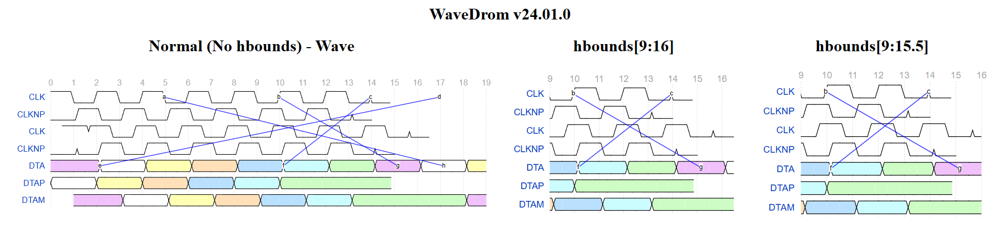

-   [Introducing WaveDrom
    24.01](#introducing-wavedrom-24.01){#toc-introducing-wavedrom-24.01}
    -   [Background and
        Motivation](#background-and-motivation){#toc-background-and-motivation}
    -   [WaveJSON Grammar](#wavejson-grammar){#toc-wavejson-grammar}
    -   [Feature Set
        Updates](#feature-set-updates){#toc-feature-set-updates}
        -   [New Skins](#new-skins){#toc-new-skins}
        -   [New Configuration
            Attributes](#new-configuration-attributes){#toc-new-configuration-attributes}
        -   [New Signal
            Attributes](#new-signal-attributes){#toc-new-signal-attributes}
        -   [New Wave
            Specifications](#new-wave-specifications){#toc-new-wave-specifications}
        -   [Revisiting the *edge*
            Architecture](#revisiting-the-edge-architecture){#toc-revisiting-the-edge-architecture}
        -   [Miscellaneus
            Features](#miscellaneus-features){#toc-miscellaneus-features}
    -   [Bug Fixes and Issue
        Resolutions](#bug-fixes-and-issue-resolutions){#toc-bug-fixes-and-issue-resolutions}
        -   [Fixing up Subcycles
            Support](#fixing-up-subcycles-support){#toc-fixing-up-subcycles-support}
        -   [Handling Phase
            Artifacts](#handling-phase-artifacts){#toc-handling-phase-artifacts}
        -   [Cleaning up the *tick* & *tock*
            Implementation](#cleaning-up-the-tick-tock-implementation){#toc-cleaning-up-the-tick-tock-implementation}
        -   [Text Labels on Single-Bit
            Bricks](#text-labels-on-single-bit-bricks){#toc-text-labels-on-single-bit-bricks}
        -   [Multi-Line Data
            Labels](#multi-line-data-labels){#toc-multi-line-data-labels}
    -   [Enabling a Plugin Wrapper
        Architecture](#enabling-a-plugin-wrapper-architecture){#toc-enabling-a-plugin-wrapper-architecture}
        -   [Custom Wave Specifications - Trigonometric
            Functions](#custom-wave-specifications---trigonometric-functions){#toc-custom-wave-specifications---trigonometric-functions}
        -   [Custom Wave Specifications - Asynchronous
            Signals](#custom-wave-specifications---asynchronous-signals){#toc-custom-wave-specifications---asynchronous-signals}
        -   [Custom Wave Specifications - Bipolar
            Signals](#custom-wave-specifications---bipolar-signals){#toc-custom-wave-specifications---bipolar-signals}
    -   [Project Roadmap](#project-roadmap){#toc-project-roadmap}
        -   [Known Issues](#known-issues){#toc-known-issues}
        -   [Pull-Request Submission
            Invites](#pull-request-submission-invites)

# Introducing WaveDrom 24.01

## Background and Motivation

WaveDrom is a timing diagram (waveform) generator widely used in
engineering circles. It converts textual description specified as a JSON
object ('WaveJSON' in WaveDrom parlance) into a vector graphics file (in
the SVG format). The use of vector graphics ensures that the diagrams
are of high quality and resistant to scaling artifacts. The software
uses a library of 'bricks' ('skin' in WaveDrom parlance) to assemble
waveforms. The usage of standard building blocks ensures a consistent
look for the rendering of different signal lanes. Waveforms created by
different users also tend to have a consistent look as long as the same
skin is being used. By virtue of being written in JavaScript, the
software is inherently cross-platform and can be run locally using any
modern web browser.

The clean and consistent look of the WaveDrom output makes it a
candidate for generating professional electrical diagrams. These are
meant for inclusion in customer-facing documents such as datasheets and
programming reference manuals. Back in 2019, the folks at Ambarella
attempted to use WaveDrom for this purpose. However, some shortcomings
of the software complicated the creation of some of the complex
waveforms. These included the [ability to combine two different
waveforms in the same signal
lane](https://github.com/wavedrom/wavedrom/issues/121) (to create, for
example, a DDR clock waveform), [over-estimation of label
widths](https://github.com/wavedrom/wavedrom/issues/265) leading to
disfigured waveforms, and [inability to composite two different
SVGs](https://github.com/wavedrom/wavedrom/issues/263) for
post-processing, among others. As a result, the output SVG had to be
manually edited to deliver a production-worthy waveform. This was not
turning out to be a scalable solution with the growth in the number of
SVGs fine-tuning of previously-finalized ones based on feedback.

Thanks to the open-source nature of the software, a custom fork was made
possible. Features were slowly added and refined based on user
requirements over the last four years. A survey of WaveJSON extensions
supported by other software such as
[SchemDraw](https://github.com/cdelker/schemdraw) and pending WaveDrom
pull requests was also made. These were also incorporated with
appropriate modifications into the custom fork. In the course of
verification, a large number of bug fixes addressing existing open
issues was also made.

WaveDrom 24.01 incorporates all the updates made over the last four
years in Ambarella's custom fork. It aims to extend WaveDrom's feature
set to address technical documentation requirements from a marketing
perspective while firming up its credentials as the de-facto solution
for engineers. As part of this overhaul, updates have been made to the
core WaveDrom engine as well as the web-based editor. The scope of this
document is restricted to the core WaveDrom engine.

## WaveJSON Grammar

The [schema
repository](https://github.com/wavedrom/schema/blob/master/waveschema.json)
currently maintained on Github under WaveDrom serves as a comprehensive
JSON representation of the WaveJSON schema. The EBNF (Extended
Backus-Naur Form) representation of the grammar provides a more concise
and terse overview. This makes it suitable for comparing extensive
updates like the ones made in the move from WaveDrom 3.3.0 to WaveDrom
24.01. The EBNF representation of the WaveJSON scheme as supported by
WaveDrom 3.3.0 is available
[here](https://github.com/Ganesh-AT/wavedrom/blob/master/WaveJSON-Grammar.txt).
The corresponding representation for the schema supported by WaveDrom
24.01 is maintained
[here](https://github.com/Ganesh-AT/wavedrom/blob/wavedrom-24.01/WaveJSON-Grammar.txt).
The new grammar is completely backwards-compatible, meaning that valid
WaveJSON inputs for WaveDrom 3.3.0 will continue to work with WaveDrom
24.01. The rendered output also remains the same, except for bug fixes.

A quick overview of the new features is obtained via Github's [diff view
of the two grammar
representations](https://github.com/Ganesh-AT/wavedrom/compare/master...wavedrom-24.01#diff-5d9dd9d1500a808115d428b898d28cb38c6a5582a822ede99298dad4fd0b4bc4).
The remainder of this document analyzes each update in detail, along
with links to examples However, a look at the new skins included in
WaveDrom 24.01 is in order first.

## Feature Set Updates

### New Skins

The WaveDrom skins dictate the appearance of various bricks along with
the styles of the markers used in the arcs (edge specifications).
Subjectively speaking, the marker style in the *default* skin is
slightly over-sized and has too much of an offset from the arc's end
points for professional documents. After a few trials, new marker styles
were finalized and incorporated into a new *professional* skin. This
formed the basis for the two additional skins described below.

Some timing diagrams require the annotation of different threshold
levels. The rise and fall times of the signals in the *default* skin are
too short to bring those out in an uncluttered manner. A new
*professional_srf* skin was prepared with signal transitions over 11
horizontal units (compared to the 6 in the *default* skin).

The representation of the transition to high-impedance states in the
*default* skin is electrically accurate, but technical document
requirements dictate a professional look with sharp transitions. The
bundled *professional_sharpz* skin addresses this aspect.

[Using the Professional Skins - WaveJSON](demo/professional-skins.json)

[ObservableHQ
Playground](https://observablehq.com/@ganesh-at-ws/wavedrom-24-01-professional-skins-fit2pane)

### New Configuration Attributes

#### Fractional *hscale* Support

WaveDrom 3.3.0 supports only positive integer values for the *hscale*
attribute in the *config* object. The [updated
grammar](https://github.com/Ganesh-AT/wavedrom/compare/master...wavedrom-24.01#diff-5d9dd9d1500a808115d428b898d28cb38c6a5582a822ede99298dad4fd0b4bc4R48)
for WaveDrom 24.01.0 adds support for fractional values less than 1.

This feature is meant to horizontally compress timing diagrams rendering
a large number of cycles. One of the oft-suggested remedies for such
diagrams is the use of the *narrow* skin. *narrower* and *narrowerer*
skins have also been created for diagrams involving 100+ cycles. While
the *narrow* skin is a true skin with different transition slopes
compared to the *default* one, the others are simply scaled versions of
the *narrow* skin with scaling values set to 0.5 and 0.25. The
incorporation of support for fractional *hscale* less than 1 avoids the
need for skins that are simply scaled versions of existing ones. It also
provides users with flexibility to adjust the horizontal width - an
aspect that is not possible with pre-generated skins.

It must be noted that the fractional *hscale* is not a straightforward
scaling operation on the whole diagram. Only the rendered bricks and
edge / node coordinates are scaled. Squished labels and arrows are
avoided by retaining the text and marker sizes based on the diagram's
skin and other configuration parameters.

[Exploring Fractional *hscale* - WaveJSON](demo/fractional-hscale.json)

[ObservableHQ
Playground](https://observablehq.com/@ganesh-at-ws/wavedrom-24-01-0-fractional-hscale)

It is possible to apply this feature to any diagram - even ones with
just a couple of cycles. This can create funny-looking waveforms with
cut-off header text and the like. However, that is not the intended
use-case for this feature. Rather, real-world timing diagrams like the
one above are the intended target.

#### Auto-Scaled Waveforms with *fit2pane*

The 20x20 bricks used by WaveDrom are too small when viewed at their
native resolution in large-sized monitors with high-resolution displays.
In such setups, waveforms dealing with a small number of cycles are
often too tiny to make out the real-time feedback in the web-based
editor. On the other hand, large waveforms in small-sized browser
windows may result in the user having to resort to horizontal scrolling
to view the effects of their edits. In such cases, users often lose
sight of the signal names on the left in the process of checking updates
at the right edge.

Fortunately, the use of vector graphics allows the resultant diagram to
be fitted inside the available viewport without loss of detail. A [new
configuration bit
(*fit2pane*)](https://github.com/Ganesh-AT/wavedrom/compare/master...wavedrom-24.01#diff-5d9dd9d1500a808115d428b898d28cb38c6a5582a822ede99298dad4fd0b4bc4R52)
can be used to enable this feature. It is disabled by default to retain
backwards compatibility.

[Enabling the *fit2pane* Feature - WaveJSON](demo/fit2pane-true.json)

[Disabling the *fit2pane* Feature - WaveJSON](demo/fit2pane-false.json)

[ObservableHQ
Playground](https://observablehq.com/@ganesh-at-ws/wavedrom-24-01-0-fit2pane-true-v-false)

Enabling this feature doesn't alter the core contents of the rendered
SVG. By default, the width and height of the picture are set to the
rendered image's absolute width and height. If *fit2pane* is set, the
width and height are configured to 100% of the picture's container
element.

#### Avoiding *style* and *defs* Leakage with *wrapSvgInImg*

The CSS and SVG specifications share a lot in common. CSS styles
specified anywhere in the document (even outside the SVG container, or
inside another one) are available for use within a SVG, and vice-versa.
This applies to SVG *defs* elements too. *defs* specified for a SVG can
end up causing issues in another SVG on the same page if it re-uses the
same element name with different characteristics. WaveDrom includes
support for embedding multiple waveforms in a single webpage. All the
examples for this feature currently employ the same skin for all
waveforms in a given page. The inability to embed waveforms using
different skins, say, *default* and *narrow*, on the same page is an
oft-raised issue.

WaveDrom 24.01 initially addressed this issue by prefixing each brick
element in the *defs* section and the utilized class names in the
*style* section using a skin-based identifier. However, this doesn't
address the markers or user-defined styles. A [new configuration bit
(*wrapSvgInImg*)](https://github.com/Ganesh-AT/wavedrom/compare/master...wavedrom-24.01#diff-5d9dd9d1500a808115d428b898d28cb38c6a5582a822ede99298dad4fd0b4bc4R53)
is available in WaveDrom 24.01 to prevent leakage of such elements
across different SVGs on the same page.

This bit is set to *true* by default to allow embedding of multiple SVGs
with different characteristics on the same page. The ObservableHQ
infrastructure for WaveDrom demonstrations (using the *wd* function)
captures he rendering output from the engine prior to the wrapping
operation. As a result, a live playground link is not available for
experimenting with this configuration bit. However, the demo files
linked below can be downloaded and rendered locally as long as the
source scripts in the header are also available at the appropriate
relative path locations.

The sample screenshot below is from the rendering of this [HTML
file](demo/test-leakage-wrapSvgInImg-true.html) with a segment of the
browser developer tools visible.

It can be seen that none of the three WaveJSON inputs have any whiff of
the *wrapSvgInImg* attribute. Each embedded waveform obeys the
parameters of its primary skin, and there is no leakage of the marker
element. The elements debugger on the right shows that the SVG is
wrapped as a data string inside an IMG tag for all the three renders.

Backwards compatibility can be obtained by explicity turning off the
*wrapSvgInImg* attribute, as shown in this [HTML
file](demo/test-leakage-wrapSvgInImg-false.html). A screenshot of this
rendering is shown below.

Two different aspects are worth pointing out here. The markers in the
diagrams with the *default* and *narrow* skins end up using the elements
in the *professional* skin. It is different from the standalone
rendering for both the WaveJSON inputs. Secondly, the browser developer
tools show that the SVGs are embedded directly in the page, and their
elements can be tracked from the same view.

This config attribute has no impact on the appearance of SVGs rendered
from standalone WaveJSON inputs. Advanced users might prefer to turn off
the feature to check up on the organization of the SVG elements using
the browser's developer tools. This is useful for debugging purposes,
but the end users of the software have no reason to bother with altering
the attribute's default value.

It must also be noted that the brick characteristics do not leak
irrespective of the configured *wrapSvgInImg* value. The leakage only
applies to the markers and optional custom styles.

#### Tweaking Arc Label Placement with *txtBaseline*

The SVG specifications provide a *dominant-baseline* attribute for text
elements. It allows the fine-tuning of the placement of the text
relative to the specified coordinates. In most cases, the default
settings combined with WaveDrom's coordinates computation provide an
acceptable appearance for the labels spcified in the WaveJSON *edge*
object. In rare cases, it might be necessary to tweak the placement. The
[new *txtBaseline* configuration
attribute](https://github.com/Ganesh-AT/wavedrom/compare/master...wavedrom-24.01#diff-5d9dd9d1500a808115d428b898d28cb38c6a5582a822ede99298dad4fd0b4bc4R54)
fulfils this purpose.

[Configuring the *txtBaseline* Feature -
WaveJSON](demo/txtBaseline-options.json)

[ObservableHQ
Playground](https://observablehq.com/@ganesh-at-ws/wavedrom-24-01-txtbaseline)

This feature is recommended for use only in small diagrams with few arc
/ edge labels. Complex diagrams often require much more flexibility,
which is provided by the user-configurable *arc_label* style class in
the *customStyle* option. WaveDrom 24.01 also brings in *tspan* support
for edge labels, and that allows for per-label modification using native
CSS attributes.

#### Tuning Rendering Results with *customStyle*

WaveDrom 24.01 supports specification of custom styles for use in the
rendered SVG using the [new
*customStyle*](https://github.com/Ganesh-AT/wavedrom/compare/master...wavedrom-24.01#diff-5d9dd9d1500a808115d428b898d28cb38c6a5582a822ede99298dad4fd0b4bc4R55)
string attribute. This is an advanced feature suggested only for users
familiar with CSS style specifications and usage.

bla bla TODO bla bla

#### Waveform Rnedering Palette Modification with *colorMode*

The WaveDrom 3.3.0 engine renders diagrams with a palette consisting of
black and a shade of blue. Some users may opt for colorful data bricks,
which may expand the palette further. Some applications require diagrams
that are either grayscale or rendered purely in black and white. While
it is possible to use post-processing software for this purpose, the sad
reality is that SVG support outside web browsers is a hit or miss when
it comes to complicated diagrams. It is a better strategy to support
such features natively prior to export, and WaveDrom 24.01 implements
that using the [new *colorMode* configuration
attribute](https://github.com/Ganesh-AT/wavedrom/compare/master...wavedrom-24.01#diff-5d9dd9d1500a808115d428b898d28cb38c6a5582a822ede99298dad4fd0b4bc4R56-R58).

The default setting for this attribute is *normal*. In this mode, the
output of the core WaveDrom engine is passed upstream as-is for
rendering. The *grayscale* and *posterize* modes apply SVG filters to
the core engine's output.

[Configuring the *colorMode* Feature with the *grayscale* Option -
WaveJSON](demo/colorMode-grayscale.json)

[ObservableHQ
Playground](https://observablehq.com/@ganesh-at-ws/wavedrom-24-01-colormode-grayscale-and-posterize)

The *purebw* mode uses only two colors - black and white. This is
achieved by converting all visible *stroke* and visible non-white *fill*
specifications in the collated SVG styleset to black. The ObservableHQ
infrastructure for WaveDrom demonstrations does not support the
modification of the collated skin / SVG styleset in the course of
rendering. As a result, the live playground link for experimenting with
the *purebw* option is not available. However, example results are
presented right below the corresponding WaveJSON linked here.

[Configuring the *colorMode* Feature with the *purebw* Option -
WaveJSON](demo/colorMode-purebw.json)

It is not advisable to use colored data bricks (*wave* characters 3
through 9) in WaveJSON that might eventually get rendered in the
*purebw* mode.

### New Signal Attributes

#### Multi-Threshold Annotations with *node_tlevel* and *node_tpos*

WaveDrom 24.01 incorporates multiple schemes for annotating different
threshold levels. The more readable approach involves [two new signal
attributes - *node_tlevel* and
*node_tpos*](https://github.com/Ganesh-AT/wavedrom/compare/master...wavedrom-24.01#diff-5d9dd9d1500a808115d428b898d28cb38c6a5582a822ede99298dad4fd0b4bc4R95-R96).

bla bla TODO bla bla

#### Tweaking Data Labels Rendering with *dlClass* and *dlStyle*

A timing diagram may have multiple data labels in different signal
lanes. Requirements dictating the modification of the appearance of all
data labels can be addressed by specifying the *data_label* class in the
*customStyle* config attribute. The rendering of data labels can also be
modified on a per-lane basis using the [new *dlClass* and *dlStyle*
attributes](https://github.com/Ganesh-AT/wavedrom/compare/master...wavedrom-24.01#diff-5d9dd9d1500a808115d428b898d28cb38c6a5582a822ede99298dad4fd0b4bc4R97-R98).
The new rendering styles can either be specified as a custom class in
the *customStyle* attribute, which is then used as the value for the
signal entry's *dlClass* attribute. Alternatively, the styles can be
specified as in-line CSS using the *dlStyle* attribute. WaveDrom 24.1
also supports the ultimate flexibility of modifying the rendering style
on a per-data label basis by incorporating *tspan* support for each
string.

bla bla TODO bla bla

#### Assembling Multiple Waveforms in a Single Lane with *overlayOnLane*

bla bla TODO bla bla

#### Tweaking Gaps Placement with *addGapsPhase*

bla bla TODO bla bla

#### Modifying Bricks on a Per-Lane Basis with *overrideSkin*, *skinClass*, and *skinStyle*

bla bla TODO bla bla

### New Wave Specifications

#### Arbitrary Text Labels with *tl*

WaveDrom 24.01 adds support for arbitrary text labels. This is
implemented as a feature set [parallel to the *pw*
functionality](https://github.com/Ganesh-AT/wavedrom/compare/master...wavedrom-24.01#diff-5d9dd9d1500a808115d428b898d28cb38c6a5582a822ede99298dad4fd0b4bc4R110)
already available in WaveDrom 3.3.0. The [grammar for the new
feature](https://github.com/Ganesh-AT/wavedrom/compare/master...wavedrom-24.01#diff-5d9dd9d1500a808115d428b898d28cb38c6a5582a822ede99298dad4fd0b4bc4R125-R131)
proposes a comprehensive scheme to set the location, contents,
background, and style of the text to be rendered.

bla bla TODO bla bla

#### Multiple Piecewise Linear (PWL) Components and Text Labels in a Lane

bla bla TODO bla bla

#### Fine-Tuning PWL Renders with *pwClass* and *pwStyle*

bla bla TODO bla bla

### Revisiting the *edge* Architecture

#### Full *tspan* Support for Edge Labels

bla bla TODO bla bla

#### Coordinates Scheme for Node Locations

bla bla TODO bla bla

supports mathematical expressions

#### Tweaking Arc and Arrow Renders

bla bla TODO bla bla

#### Re-factored Edge Shape Implementation

bla bla TODO bla bla

### Miscellaneus Features

The updated WaveJSON grammar in WaveDrom 24.01 provides users with new
options to render timing diagrams. Beyond these, the new release also
introduces features not related directly to the WaveJSON input.

#### Pre-Export SVG Optimization

WaveDrom supports native export of rendered diagrams to SVG or PNG via a
context menu. This is available for embedded diagrams rendered via the
ProcessAll feature. The SVG exported by WaveDrom 3.3.0 includes all
element definitions in the used skin, even when the rendered diagram
doesn't make use of all of them. WaveDrom 24.01 supports multiple skins
in the same diagram, along with per-lane skin overrides and custom skin
styles. This may cause a linear increase in the number of element
definitions in the rendered SVG.

The SVG export process in WaveDrom 24.01 incorporates support for the
removal of unused *defs* elements. This optimization process is
triggered only during the export process, and is not part of the
real-time rendering flow. The extent of savings depends on the number of
skin elements actually used in the timing diagram. As an example, a
simple diagram with two clocks
\[[WaveJSON](demo/svg-optimize-demo.json)\] exported by WaveDrom 3.3.0
clocks in at [42549 bytes](demo/Clocks-3.3.0-Export.svg), while it is
only [8003 bytes](demo/Clocks-24.01.0-Export.svg) via WaveDrom 24.01.
This is despite the latter including metadata information with the
original WaveJSON source.

#### WaveJSON Metadata Inclusion in Exported SVG

WaveDrom 24.01 incorporates support for embedding the WaveJSON source
into the exported SVG. This is placed in a metadata element with a
*WaveJS* identifier. The software supports JavaScript code in its input,
if it acts as a pre-processor for generating the actual WaveJSON object
rendered by the core engine. The WaveJSON in the metadata section is
placed as received, and includes the optional pre-processing JavaScript
code as well.

An example of a SVG with metadata exported by WaveDrom 24.01 is
reproduced below.

Opening up the SVG in a text editor shows the embedded metadata being an
exact replica of the original source code.

The source has to be enclosed within a comments section in order to pass
SVG 1.1 validation checks. The first line in this section also includes
the SVG-exporting WaveDrom's version information. The editor application
incorporates support for importing SVGs with such embedded metadata.

#### Improved PNG Export

WaveDrom 3.3.0 exports rasterized PNG versions of rendered diagrams at
their native resolution. These do not respond well to scaling. WaveDrom
24.01 incorporates a pre-rasterizing scaling factor of 20 to provide
reasonable results. This factor is a constant for embedded diagrams, but
the editor application allows it to be configured.

#### Improved Dimensions Estimation for Text Elements

The initial releases of WaveDrom in the early 2010s utilized the
DOM-reliant getBBox() method to estimte the width of different text
elements. This estimation is important to determine the best possible
position for the element relative to the existing ones in the waveform.
The reliance on the DOM (document object model) meant that WaveDrom
needed a browser engine in order to do its work. A push towrds enabling
a browserless version with server-side rendering support resulted in the
removal of the DOM-reliant getBBox() method from the code base.

WaveDrom 24.01 offers flexibility in styling support for text elements.
Using pre-generated text widths for characters is not a suitable
solution when it is possible to vary the size and even line counts for
different text elements. WaveDrom 24.01 brings back support for the
getBBox() method in the presence of a browser engine, and falls back to
the legacy width estimation scheme otherwise. The implementation creates
a temporary render area where each text element is rendered for
determining the bounding box dimensions and then removed.

#### Fine-Tuning the *hbounds* Feature

The implementation of the *hbounds* feature in WaveDrom 3.3.0 allows for
one extra brick relative to the provided upper bound. There is no
allowance for specifying a non-integer bounds, and hence, the resultant
image always ended up with an odd number of bricks. In addition,
out-of-bounds arcs continue to remain in the diagram. An example is
available in this [HTML file](demo/test-hbounds-max-legacy.html) using
the scripts available in the official website. A screenshot of the
rendering on December 20, 2023 is reproduced below.The rendering based
on the in the public website as of December 20, 2023.

WaveDrom 24.01 incorporates support for half-cycle specifications in the
*max* component of the *hbounds\[min:max\]* attribute. It also fixes the
rendering of the out-of-bounds arcs.

The above screenshot is from the rendering of this [HTML
file](demo/test-hbounds-max.html).

Piecewise linear waveforms and text labels have also been similarly
handled to ensure that the original intention of the *hbounds* feature
(isolating a range of cycles from a larger waveform) is retained.

#### Supporting Multiple Transition Slopes for Node Placement

bla bla TODO bla bla

related to *node_tlevel* and *node_tpos* features

## Bug Fixes and Issue Resolutions

bla bla TODO bla bla intro component

### Fixing up Subcycles Support

include discussion of gaps and nodes issue #213 in resolve library

### Handling Phase Artifacts

bla bla TODO bla bla

### Cleaning up the *tick* & *tock* Implementation

bla bla TODO bla bla

### Text Labels on Single-Bit Bricks

bla bla issue #302 and #310 in resolve library TODO bla bla

### Multi-Line Data Labels

issue #341 in resolve library

## Enabling a Plugin Wrapper Architecture

bla bla BIG TODO bla bla intro component

### Custom Wave Specifications - Trigonometric Functions

bla bla TODO bla bla

### Custom Wave Specifications - Asynchronous Signals

bla bla TODO bla bla

### Custom Wave Specifications - Bipolar Signals

bla bla TODO bla bla

## Project Roadmap

bla bla TODO bla bla

### Known Issues

bla bla TODO bla bla

### Pull-Request Submission Invites

bla bla TODO bla bla
